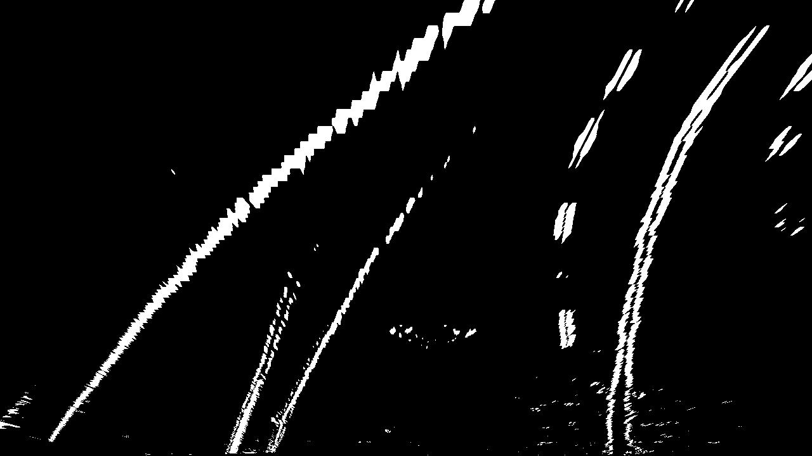

# Self-driving-car-Advanced

**The goals / steps of this project are the following:**
* Compute the camera calibration matrix and distortion coefficients given a set of chessboard images.You only need to compute these once
* Apply a distortion correction to raw images.
* Use color transforms, gradients, etc., to create a thresholded binary image.
* Apply a perspective transform to rectify binary image ("birds-eye view"). Pick four points in a trapezoidal shape (similar to region masking)
	1. Plotting a histogram of where the binary activations occur across the image
	2. then use sliding windows moving upward in the image (further along the road) to determine where the lane lines go
	3. Fit a polynomial
* Determine the [curvature](https://www.intmath.com/applications-differentiation/8-radius-curvature.php) of the lane and vehicle position with respect to center. Keep in mind
	1. the lane is about 30 meters long and 3.7 meters wide
	2. minimum lane width of 12 feet or 3.7 meters, and the dashed lane lines are 10 feet or 3 meters long each
	3. our camera image has 720 relevant pixels in the y-dimension (remember, our image is perspective-transformed!)
	4. and we'll say roughly 700 relevant pixels in the x-dimension (the example of fake generated data used from 200 pixels on the left to 900 on the right, or 700).

# Color Transform
| Process         | Output        | 
------------ | -------------
Read in and grayscale the image||
