# Self-driving-car-Advanced


* [Ipython notebook](https://github.com/dannofield/Self-driving-car-Advanced/blob/master/IpythonNotebook.ipynb) has all the process and at the end shows how to put everything together to show and process the video in real time
* Source Code	
	1. [Project2.py](https://github.com/dannofield/Self-driving-car-Advanced/blob/master/Project2.py) Plays the video in real time
* [Result/Output images](https://github.com/dannofield/Self-driving-car-Advanced/tree/master/output_images)
* [Video Output](https://github.com/dannofield/Self-driving-car-Advanced/upload/master/test_videos_output)


**The goals / steps of this project are the following:**
* Compute the camera calibration matrix and distortion coefficients given a set of chessboard images.You only need to compute these once
* Apply a distortion correction to raw images.
* Use color transforms, gradients, etc., to create a thresholded binary image.
* Apply a perspective transform to rectify binary image ("birds-eye view"). Pick four points in a trapezoidal shape (similar to region masking)
	1. Plotting a histogram of where the binary activations occur across the image
	2. then use sliding windows moving upward in the image (further along the road) to determine where the lane lines go
	3. Fit a polynomial
* Determine the [curvature](https://www.intmath.com/applications-differentiation/8-radius-curvature.php) of the lane and vehicle position with respect to center. Keep in mind
	1. the lane is about 30 meters long and 3.7 meters wide
	2. minimum lane width of 12 feet or 3.7 meters, and the dashed lane lines are 10 feet or 3 meters long each
	3. our camera image has 720 relevant pixels in the y-dimension (remember, our image is perspective-transformed!)
	4. and we'll say roughly 700 relevant pixels in the x-dimension (the example of fake generated data used from 200 pixels on the left to 900 on the right, or 700).

# Camera Calibration And undistort image
| Original |Undistorted|
------------ | -------------
|

# Perspective Transform

The code for my perspective transform includes a function called `perspective_transform()`, which appears in lines 200 through 204 in the file [Proyect2.py](https://github.com/dannofield/Self-driving-car-Advanced/blob/master/Project2.py).  The `perspective_transform()` function takes as inputs an image (`img`), as well as the perspective transform matrix (`M`).  I chose the hardcode the source and destination points in the following manner:

```python
transform_src = np.float32([
	[180,720],[575,460],[710,460],[1133,720]
	])
	
transform_dst = np.float32([
	[300,720],[290,50],[980,50],[950,720]
	])
```

This resulted in the following source and destination points:

| Source        | Destination   | 
|:-------------:|:-------------:| 
| 180, 720      | 300, 720      | 
| 575, 460      | 290, 50      |
| 710, 460     | 980, 50      |
| 1133, 720    | 950, 720        |

### Perspective Transform

| Original |Perspective transform|
------------ | -------------
|

# Color Transform
| Perspective transform | S channel Only |Sobel + thresholds | Combined | Yellow & White mask only|
------------ | ------------- | ------------- | ------------- | -------------
||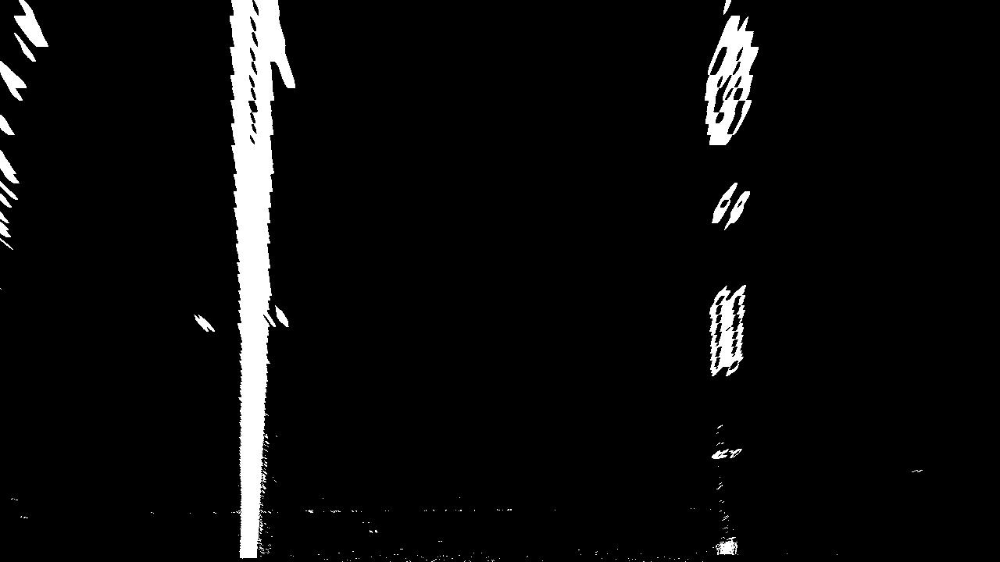|||
|||||
|||||
|||||
|||||
|||||
|||||
|||||
|||||
|||||
|||||
|||||
|||||


### Final color transform
After many tries I decided to use the following color transform because it was the best one I could find
```python
def color_transform(img):
    # Note: img is the undistorted image

    ##################################
    # Sobel x
    ##################################
    # Grayscale image    
    gray = cv2.cvtColor(img, cv2.COLOR_RGB2GRAY)
    
    sobelx = cv2.Sobel(gray, cv2.CV_64F, 1, 0) # Take the derivative in x
    abs_sobelx = np.absolute(sobelx) # Absolute x derivative to accentuate lines away from horizontal
    scaled_sobel = np.uint8(255*abs_sobelx/np.max(abs_sobelx))

    # Threshold x gradient
    thresh_min = 15#30  #20
    thresh_max = 100#45  #100
    sxbinary = np.zeros_like(scaled_sobel)
    sxbinary[(scaled_sobel >= thresh_min) & (scaled_sobel <= thresh_max)] = 1

    ######################################
    # Threshold color channel
    ########################################
    # Convert to HLS color space and separate the S channel
    hls = cv2.cvtColor(img, cv2.COLOR_RGB2HLS)
    s_channel = hls[:,:,2]
    
    s_thresh_min = 170#180 #170
    s_thresh_max = 255#200 #255
    s_binary = np.zeros_like(s_channel)
    s_binary[(s_channel >= s_thresh_min) & (s_channel <= s_thresh_max)] = 1

    # Combine the two binary thresholds
    combined_binary = np.zeros_like(sxbinary)
    combined_binary[(s_binary == 1) | (sxbinary == 1)] = 1
    
    #############################################################
    # Get only the S channel    
    #############################################################
    binary_S_channelOnly = np.zeros_like(s_channel)
    binary_S_channelOnly[(s_channel > 90) & (s_channel <= 255)] = 1    
    
    #mixed
    super_mixed = np.zeros_like(s_channel)
    super_mixed[(binary_S_channelOnly == 1) | (combined_binary == 1)] = 1
    
    
    return super_mixed	#combined_binary

```

# Find lane with Hystogram & Sliding Windows
| Perspective transform | S channel + Sobel + thresholds | Sliding Windows |
------------ | ------------- | ------------- | 
||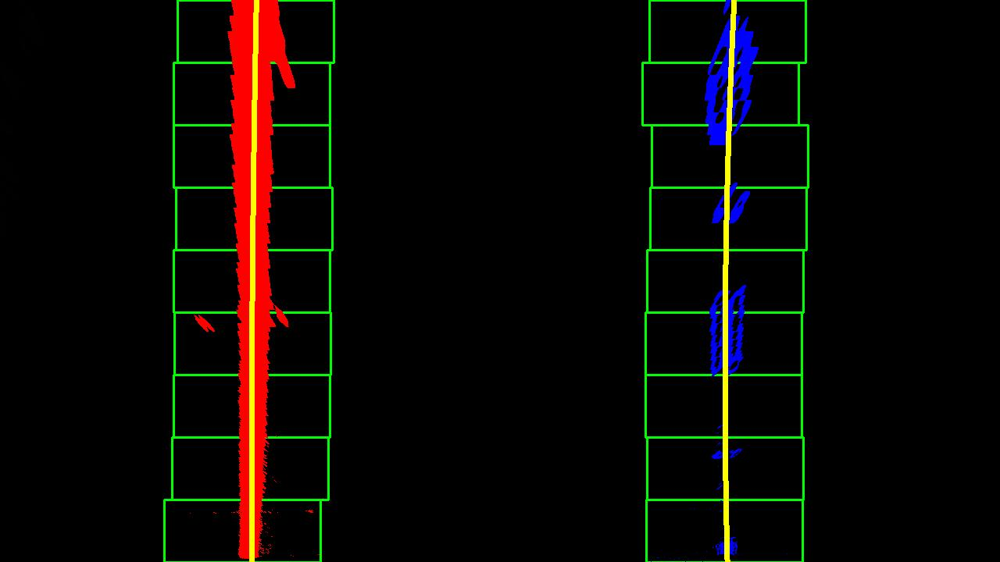|
|||
|||
||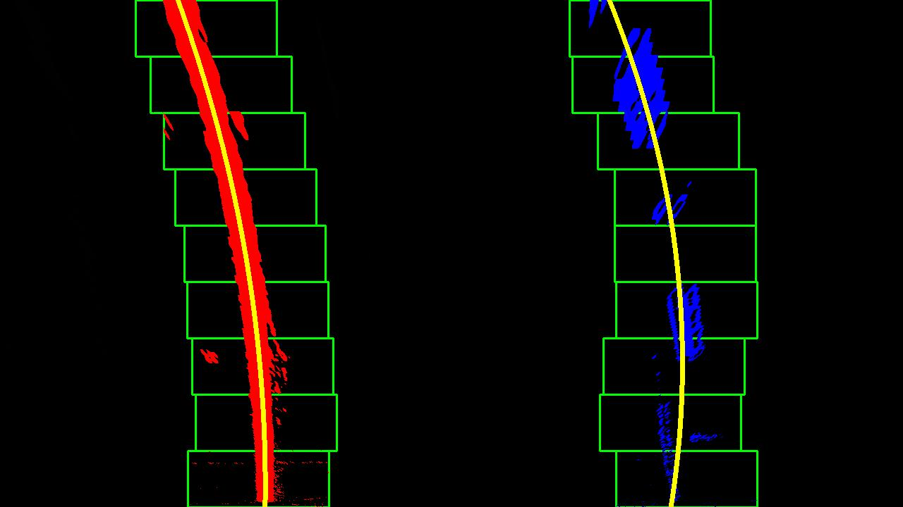|
||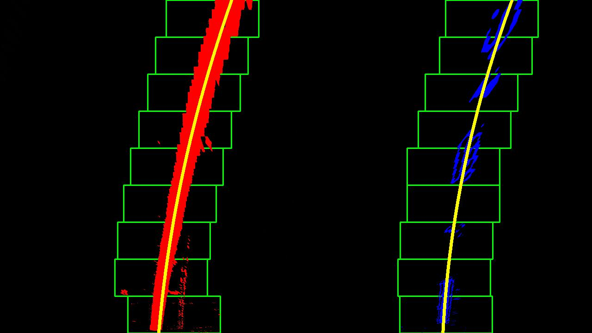|
||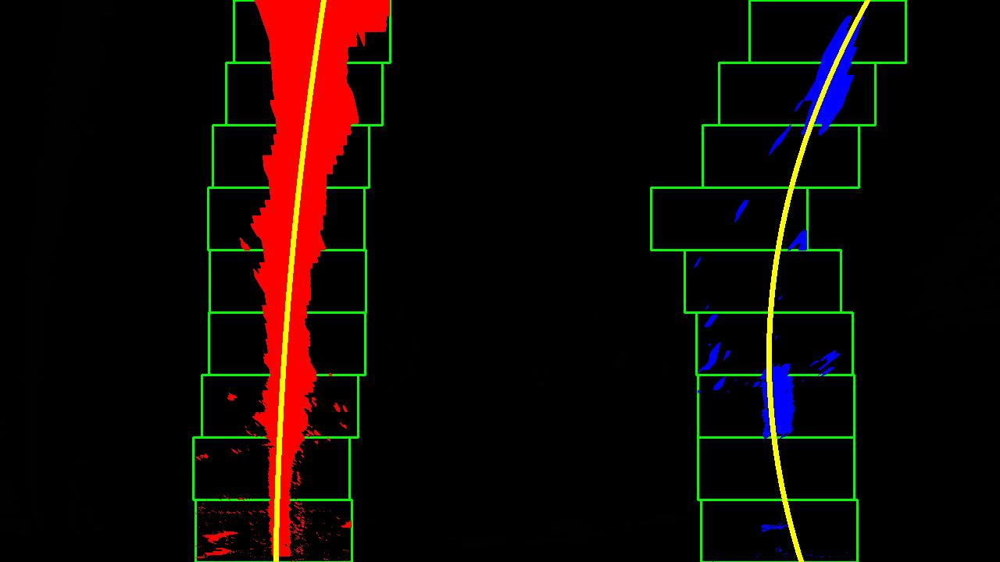|
|||
||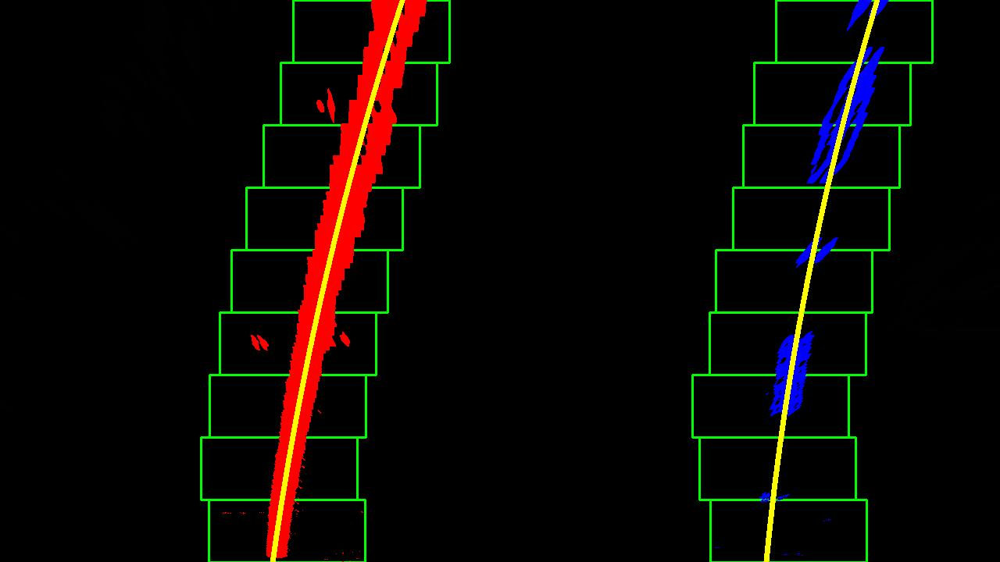|
|||
|||
||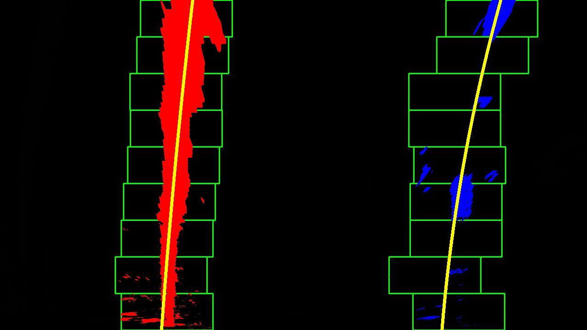|
||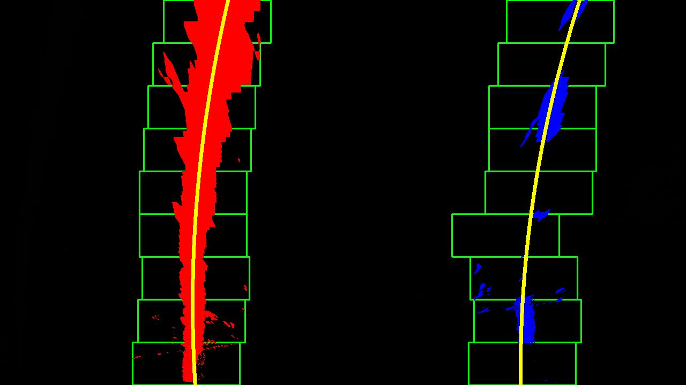|
|||

### Measuring the Curvature, distance of both lines from the center and car's offset

After finding the lines, I measured the curvature of each one. The function called `measure_curvature_real()`, which appears in lines 404 through 463 in the file [Proyect2.py](https://github.com/dannofield/Self-driving-car-Advanced/blob/master/Project2.py).  The `measure_curvature_real()` function takes as inputs an image (`img` just to get its shape), as well as the left and right lines (`left_Line, right_Line`).  found them through hystograms and sliding windows or by searching around polygon:


```python
def measure_curvature_real(img, left_Line, right_Line):
    '''
    Calculates the curvature of polynomial functions in meters.
    '''
    # Define conversions in x and y from pixels space to meters
    ym_per_pix = 30/720 # meters per pixel in y dimension
    xm_per_pix = 3.7/700 # meters per pixel in x dimension
    
    # Define y-value where we want radius of curvature
    # We'll choose the maximum y-value, corresponding to the bottom of the image
    # Define y-value where we want radius of curvature
    # I'll choose the maximum y-value, corresponding to the bottom of the image
    h = img.shape[0]
    ploty = np.linspace(0, h-1, h)
    y_eval = np.max(ploty)
    y_eval = y_eval * ym_per_pix
    
    left_curverad = 0
    right_curverad = 0
    
    r_fit_x_int = 0
    l_fit_x_int = 0
    
    # Distance from center is image x midpoint - mean of l_fit and r_fit intercepts 
    if left_Line.best_fit is not None and right_Line.best_fit is not None:
        
        left_fit = [0,0]
        right_fit = [0,0]
        ##############################
        #scale coefficients and y_eval from pixels to meters
        ##############################
        left_fit[0] = (xm_per_pix / ym_per_pix**2) * left_Line.best_fit[0]
        left_fit[1] = (xm_per_pix / ym_per_pix) * left_Line.best_fit[1]
    
        right_fit[0] = (xm_per_pix / ym_per_pix**2) * right_Line.best_fit[0]
        right_fit[1] = (xm_per_pix / ym_per_pix) * right_Line.best_fit[1]
    
        
        #Implement the calculation of R_curve (radius of curvature)
        left_curverad = ((1 + (2*left_fit[0]*y_eval + left_fit[1])**2)**1.5) / np.absolute(2*left_fit[0])
        right_curverad = ((1 + (2*right_fit[0]*y_eval + right_fit[1])**2)**1.5) / np.absolute(2*right_fit[0])
        
        # Now our radius of curvature is in meters        
        
        l_fit_x_int = left_Line.best_fit[0]*h**2 + left_Line.best_fit[1]*h + left_Line.best_fit[2]
        r_fit_x_int = right_Line.best_fit[0]*h**2 + right_Line.best_fit[1]*h + right_Line.best_fit[2]
        
        #If we don't have data just don't change the data from the previous frame
        
        #radius of curvature of the line in some units
        left_Line.radius_of_curvature = left_curverad 
        right_Line.radius_of_curvature = right_curverad
    
        #distance in meters of vehicle center from the line
        car_position = (img.shape[1]/2) * xm_per_pix
        
        left_Line.line_base_pos = l_fit_x_int * xm_per_pix - car_position
        right_Line.line_base_pos = car_position - r_fit_x_int * xm_per_pix
        
    return left_Line, right_Line
```


# FINAL PIPELINE

This is the main algorith which starts by calibraring the camera, defining the source and destination points to create our trasnformation matrix and then it enters to while loop to read each video frame and processing the image. The algorithm is self-explanatory but you can find the source code in the file [Proyect2.py](https://github.com/dannofield/Self-driving-car-Advanced/blob/master/Project2.py) on the line 147 (color_transform)


```python
################################################
# Camera Calibration
################################################
objpoints, imgpoints, mtx, dist = camera_calibration()

################################################
# Perspective transform points and Matriz
################################################

# define 4 source points src
transform_src = np.float32([[180,720],[575,460],[710,460],[1133,720]])
# define 4 destination points dst
transform_dst = np.float32([[300,720],[290,50],[980,50],[950,720]])

# use cv2.getPerspectiveTransform() to get M, the transform matrix
transform_M = cv2.getPerspectiveTransform(transform_src, transform_dst)
transform_Minverse = np.linalg.inv(transform_M)
 
################################################
# List to save our polynomial fit result to help
# with our next frame 
################################################   
left_Line = Line()
right_Line = Line()

videos = ['test_videos/project_video.mp4','test_videos/challenge_video.mp4','test_videos/harder_challenge_video.mp4']
indexVideo = 0
video = cv2.VideoCapture(videos[indexVideo])

#Play videos showing lines in Real Time
saveFrameIndex = 0
while True:
    ret,frame = video.read() 
    if not ret:
        #Get another video... or exit
        break

    # Note: always make a copy rather than simply using "="
    img = np.copy(frame) #img = frame
    
    #Process image and show the final image as a frame
    ################################################
    # Distortion Correction
    ################################################
    undst_img = distortion_correction(img, mtx, dist)

    ################################################
    # Full color threshold transform
    ################################################
    thresholded_binary_img = color_transform(undst_img)

    ################################################
    # Perspective transform
    ################################################
    warped_img = perspective_transform(thresholded_binary_img, transform_M)

    ################################################
    # Find lane by either using a sliding window loop
    # or previous polinomial fit points
    ################################################ 
    left_Line, right_Line = find_lane(warped_img, left_Line, right_Line) 
    
    ################################################
    # Find curvature if we have found the lines
    ################################################
    left_Line, right_Line = measure_curvature_real(img, left_Line, right_Line)
        
    ################################################
    # Draw lane on top of the original image/frame
    ################################################
    frameToShow = draw_lane(warped_img, img, left_Line, right_Line, transform_Minverse)
   
    ################################################
    # Draw the curvature radious and car's offset
    ################################################   
    frameToShow = draw_curvature_data(frameToShow, left_Line, right_Line)
    
    cv2.imshow("frame",frameToShow)
    key = cv2.waitKey(25)
    if key == 27:#ESC Key to quit
        break;
          
        
video.release()
cv2.destroyAllWindows()
```

# Areas where improvements could be made

We can definitely have a significant improvement by modifying the color transform algorithm by itself.

I tried different ways, you can see two different functions in the file [Proyect2.py](https://github.com/dannofield/Self-driving-car-Advanced/blob/master/Project2.py), a function called `color_transform()` at line 147 and `color_transform2()` at line 123.

I couldn't find a better solution, both have different approachs and I ended up using `color_transform()` .

It works great with the project video but not with the challenges one. 
Here you can see the output of the color transform function and the sliding window algorithm struggling to find the right lines.


## Challenge Video Color Transform
| Perspective transform | S channel Only |Sobel + thresholds | Combined | Yellow & White mask only|
------------ | ------------- | ------------- | ------------- | -------------
|||||
|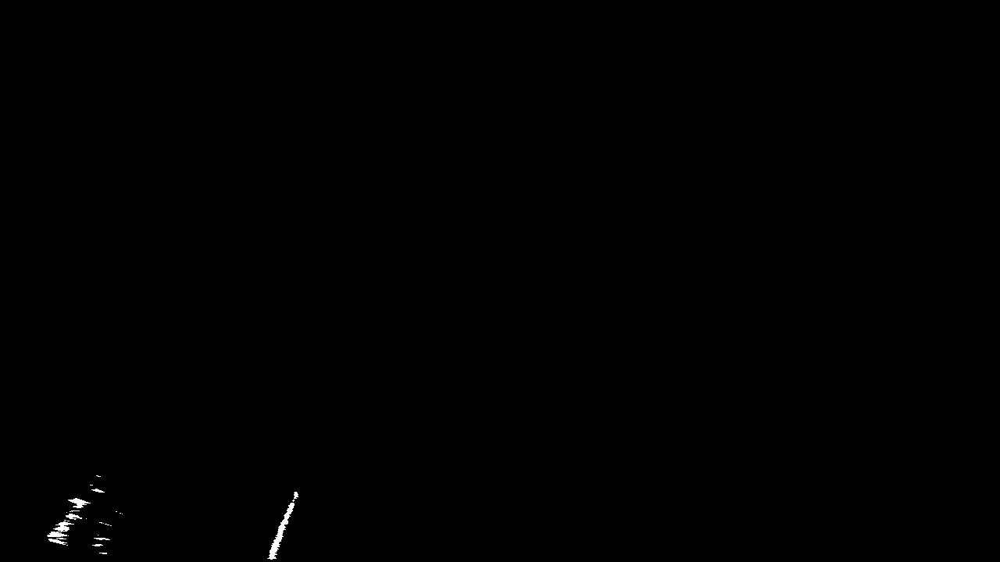||||
|||||
|||||
|||||

## Find lane with Hystogram & Sliding Windows on CHALLENGE Video
| Perspective transform | S channel + Sobel + thresholds | Sliding Windows |
------------ | ------------- | ------------- | 
||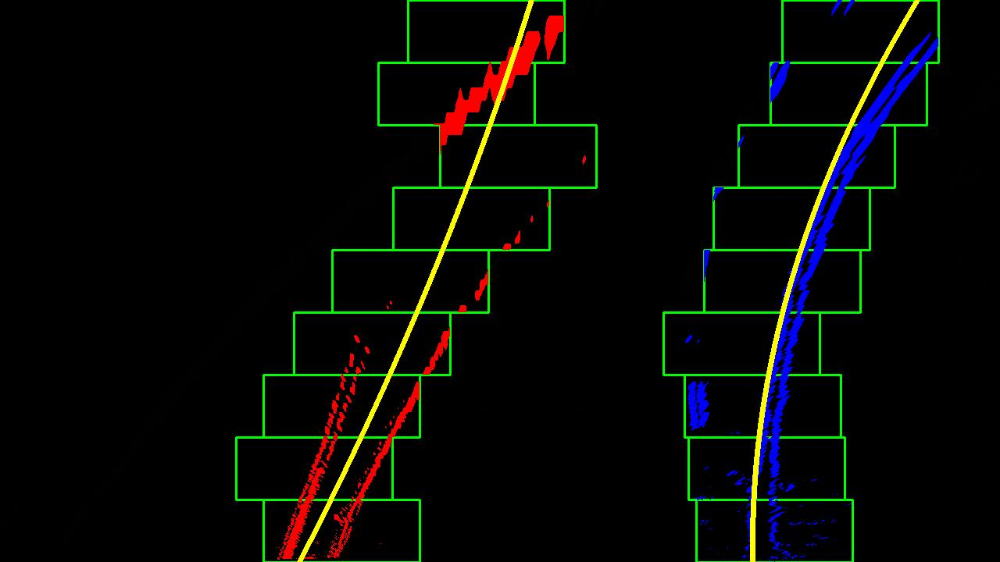|
|||
|||
||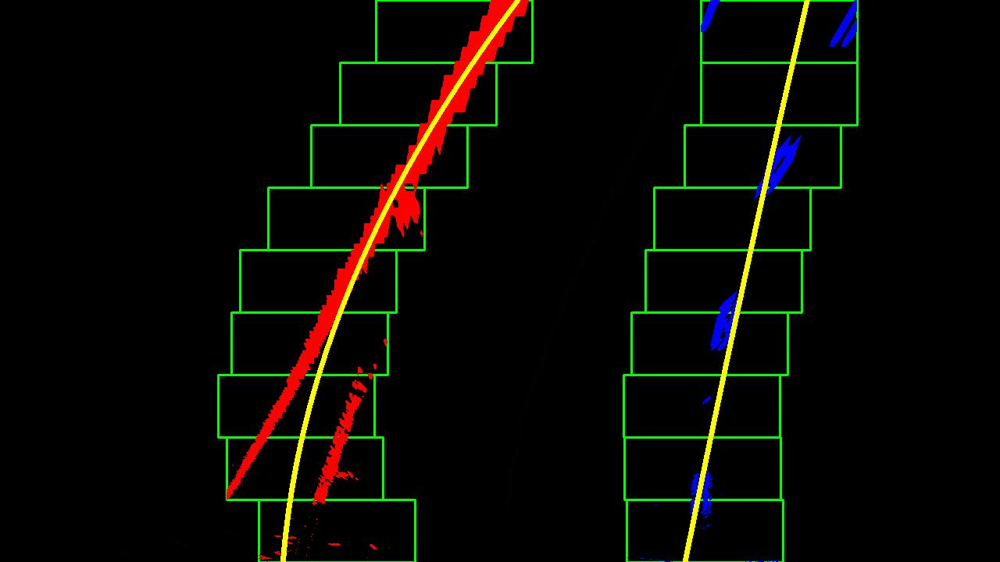|
||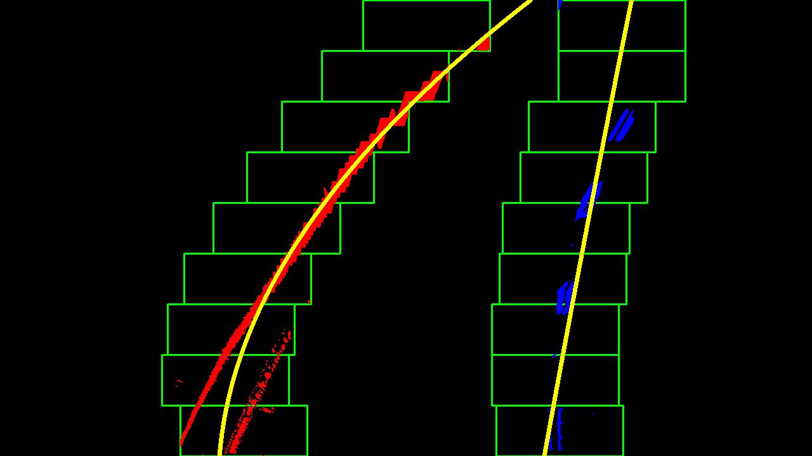|
|||
|||
||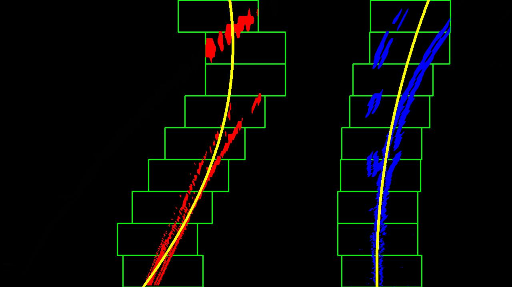|
||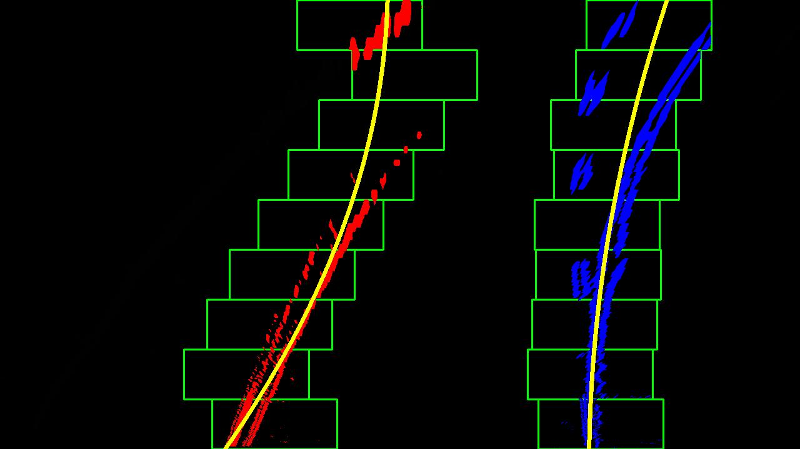|
|||

# Discussion

We can see an enormous difference in between finding lanes by only using Run Hough / Canny transforms and using camera calibration, color and perspective transform and trying to fit a polynomial.

I found that I was able to reduce the "search window" width if we already had found the lines on the previous frame. Nevertheless, the color transform function on my algorithm can be improved a lot.

I tried to follow discussions on internet and projects from previous students showing how successfully they were able to run the algorithm on the challenge video. But for some reason, I could not make it work, even adjusting the source and destination points or color thresholds.

I think that even with a great algorithm there are a lot of things that we should be concerned about, like when the car is changing lanes, very narrow routs and poorly signaling on the street.

I hope I can find a better approch in the future by using machine learning.

## References
Original project taken from:
[CarND-Advanced-Lane-Lines](https://github.com/udacity/CarND-Advanced-Lane-Lines). Thank you

 References to external Projects and Readings
[Computer vision with OpenCV](https://chatbotslife.com/self-driving-cars-advanced-computer-vision-with-opencv-finding-lane-lines-488a411b2c3d) and [Advanced Lane-Finding](https://towardsdatascience.com/udacity-self-driving-car-nanodegree-project-4-advanced-lane-finding-f4492136a19d)
    
